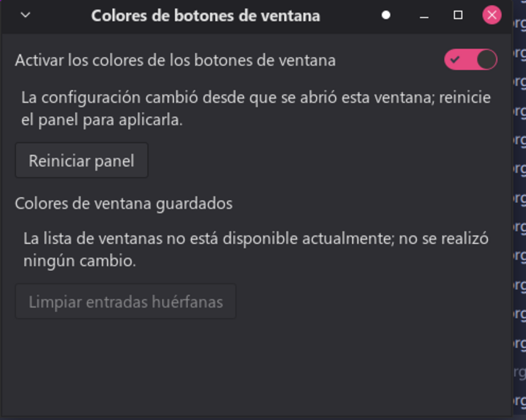

# Tell your panel's window buttons apart, by colour

Four VS Code windows in the XFCE panel look like four identical icons. This gives each one its own background colour, so you can find the right window at a glance instead of hovering over each button to read its title.


*Three windows of the same editor, each tagged a different colour. Everything else on the panel is untouched.*

It is a GTK 3 module loaded in-process by `xfce4-panel`. It adds a **Background colour** item to the right-click menu of any window button, and paints that button's background. Nothing else on the panel is touched.

> **Scope.** Colours are per window and survive a panel restart. They do **not** survive restarting the application itself — see [Why colours reset](#why-colours-reset-when-an-app-restarts).

## Quick path

1. Install the package:
   ```sh
   sudo dpkg -i xfce4-window-button-colors_0.2.0_amd64.deb
   sudo apt-get -f install     # pulls in any missing dependency
   ```
2. Open **Settings Manager → Window Button Colors** (or run `xfce4-window-button-colors-settings`), turn on **Enable window button colours**, then click **Restart Panel**.
3. Right-click any window button in the panel → **Background colour** → pick one.

The button should be painted immediately. If it is not, see [Troubleshooting](#troubleshooting).

Step 2 has its own window — see [Settings application](#settings-application-recommended) for a picture of it and what each control does.

Prefer the command line, or need to script this? See [Enabling and disabling](#enabling-and-disabling) for the equivalent `xfconf-query` commands.

## Using it

Right-clicking a window button adds one entry to the menu the panel already shows:

| You want | Do this |
|----------|---------|
| A quick colour | **Background colour** → one of the eight swatches |
| A specific colour | **Background colour** → **Custom…** → full picker, with transparency |
| A colour already on screen | **Custom…** → the eyedropper button → click anywhere |
| Remove the colour | **Background colour** → **No colour** |

A tick marks whichever entry is currently applied, including **No colour**.

Every surface that sets a colour can also clear it. You never have to back out of a menu to undo a choice.

## Why colours reset when an app restarts

A colour is bound to the **X window id**, which is the only thing that identifies one window of an application separately from another. That id is assigned when the window opens and is not reused when it reopens, so:

- **Restarting the panel keeps your colours.** The windows are still open, their ids are unchanged, and the module reconciles what it stored against the windows that are actually live.
- **Closing and reopening an application loses that window's colour.** It is a new window with a new id.

The alternative would be binding to the application instead of the window, which persists forever but paints *every* window of that application the same colour — which is exactly the problem this tool exists to solve. The window title is not an anchor either, since it changes as you work.

Rules of the shape *"windows of app X whose title contains Y always get colour Z"* are a possible future addition, not part of this release.

## Configuration

| Item | Path |
|------|------|
| Stored colours | `~/.config/xfce4-window-button-colors/` |
| Installed module | `/usr/lib/<triplet>/gtk-3.0/modules/libxfce4-window-button-colors.so` |

The stored file is generated. Editing it by hand is not expected to be useful, but a truncated or malformed one will never cost you your colours: it degrades to what can still be read, with a single warning.

## Enabling and disabling

Installing the package does **not** enable the module. That is deliberate.

Enabling means adding the module to your session's GTK module list, which persists across logins. If a module there ever failed to load, you would be left without a panel at the next login and would need a TTY to recover. Turning it on is your decision, made once, and reversible.

### Settings application (recommended)



Open **Settings Manager → Window Button Colors**, or run `xfce4-window-button-colors-settings` directly.

| Control | What it does |
|---------|--------------|
| **Enable window button colours** | Writes or removes the module in `/Gtk/Modules`. Never restarts the panel by itself. |
| **Restart Panel** | Applies the change, after a confirmation that shows you the recovery command first. |
| **Stored window colours** | Your coloured windows, by current title. Remove one, or clear the ones whose windows are gone. |

**Always disable through this application.** It edits the existing `/Gtk/Modules` value in place and leaves every other entry untouched, which a blind key reset does not — see the alternative below.

The screenshot above shows the app being deliberately cautious: it could not read the window list reliably, so it says so and greys out **Clear orphaned entries** rather than showing an empty list. An empty list would read as "you have no colours", and acting on that would delete colours you still want.

### Alternative: `xfconf-query` directly

For scripting, or a one-off session without the settings application:

```sh
# On
xfconf-query -c xsettings -p /Gtk/Modules -n -t string -s xfce4-window-button-colors
xfce4-panel -r
```

There is no equally simple one-line command to turn it back off this way. The command shown in [Troubleshooting](#troubleshooting) for TTY recovery resets the *entire* `/Gtk/Modules` key, which deletes any other application's autoload module too if the key lists more than one — that is why it is a recovery instruction, not the ordinary disable command. Use the settings application to disable safely, or edit the key by hand only once you have confirmed its current shape holds nothing else.

To try the module for one panel session only, without touching your session settings at all:

```sh
pkill -x xfce4-panel
GTK_MODULES=xfce4-window-button-colors xfce4-panel &
```

## Requirements

`xfce4-panel` 4.16 or newer, GTK 3.22+, GLib 2.56+, libwnck 3, xfconf 4.12+. Tested on XFCE 4.18.4.

## Building from source

```sh
sudo apt-get install build-essential meson ninja-build pkg-config gettext \
  libglib2.0-dev libgtk-3-dev libwnck-3-dev libxfconf-0-dev

meson setup build
meson compile -C build
meson test -C build
```

To build the package instead:

```sh
sudo apt-get install debhelper devscripts fakeroot
dpkg-buildpackage -us -uc -b
```

## Troubleshooting

| Symptom | Cause and fix |
|---------|---------------|
| Menu entry missing | The module is not loaded. Confirm with `grep -c window-button-colors /proc/$(pgrep -x xfce4-panel)/maps` — `0` means it did not load. |
| Nothing paints, no error | Check the panel's output for a CSS warning. A rejected rule is discarded deliberately rather than crashing the panel, so it shows only as a log line. |
| Wrong button painted | Report it. Two windows sharing an identical title is the known hard case. |
| Panel gone after enabling | Recover from a TTY with `xfconf-query -c xsettings -p /Gtk/Modules -r`, then log in again. |

The module never aborts the panel: a missing, unreadable or malformed configuration degrades to "no colours" plus one warning, and it does nothing at all in any process that is not `xfce4-panel`.

## Licence

GPL-2.0-or-later.
